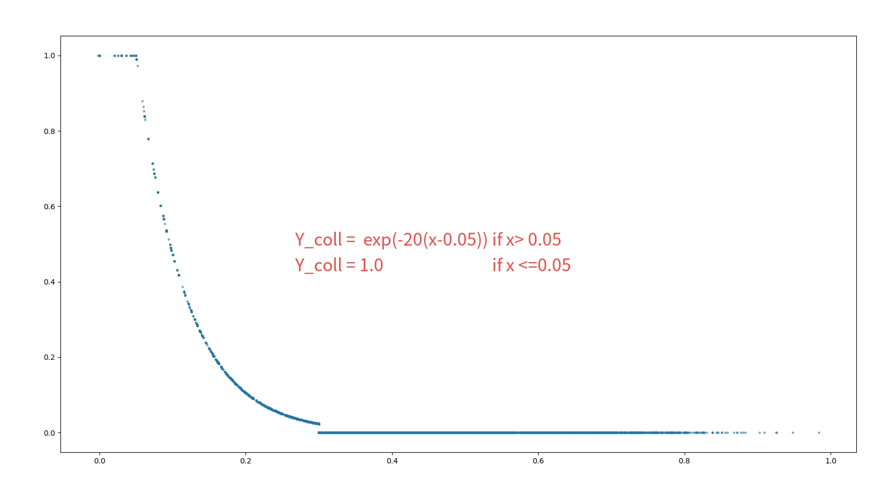
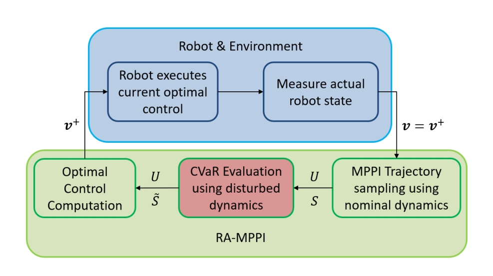

# 修正
** 修正Franka Env Bug
```python
不能仅仅只是设置关节状态  还要对齐相应的目标状态 不然就默认目标为初始关节状态 0 0 0 ...
  self.gym.set_actor_dof_states(env_handle, robot_handle, robot_dof_states, gymapi.STATE_ALL) # 设置的是当前状态 并不是目标状态 下一个step机械臂会偏向目标状态
  self.gym.set_actor_dof_position_targets(env_handle, robot_handle, np.float32(robot_dof_states['pos']))
```
** 修正了MPPI.py算法 将β参数拆出来 分析清楚 \
** 添加了多个benchmark文件，对比β影响 对比topN影响 对比PPV影响 来更好的分析最终结果\
** 添加了多个轨迹指标： 
1. crash-rate(一个lap有没有发生碰撞)
2. path-length(代替opt_steps)，比较轨迹的长度
3. avg.speed : 期望大家在同一个速度下去比较（目前效果不是很好，没有发现调速影响最大的参数）\

** 对2D Mass 可视化 做修改，图片叠加虚影

# TODO
```python
  # TODO : 这里应该怎么写 更加完善呢 目前只适用于 2D pass ,不对Franka生效 暂行的方案就是注释
  self.greedy_mean_traj, self.sensi_mean_traj, self.greedy_best_traj, self.sensi_best_traj,self.mean_traj = 
  self.get_multimodal_mean_trajectory(state)
```

# STORM
**Stochastic Tensor Optimization for Robot Motion** - *A GPU Robot Motion Toolkit*

[[Install Instructions](install_instructions.md)] [[Paper](https://arxiv.org/abs/2104.13542)] [[Website](https://sites.google.com/view/manipulation-mpc/home)]

This package contains code for reactive robot motion leveraging parallel compute on the GPU. The implemented control framework leverages MPPI to optimize over sampled actions and their costs. The costs are computed by rolling out the forward model from the current state with the sampled actions. Most files are documented with sphinx. Once you clone this repo, go into docs folder and run `sh generate_docs.sh` to generate documentation.

**To run on a real Franka Panda, you can use this low-level control wrapper:** [franka_motion_control](https://github.com/mohakbhardwaj/franka_motion_control) from [Mohak Bhardwaj](https://github.com/mohakbhardwaj).
<p align="center">
  
  
</p>


## 1. voxel to sdf 
lean from   STOMP and [RAMP](https://samsunglabs.github.io/RAMP-project-page/).
<p align="center">
  
  
  
</p>

## 2. Sparse Reward for MPPI motivated by RL
learn from [Collaborative Interaction Models for Optimized Human-Robot Teamwork](https://ieeexplore.ieee.org/document/9341369)
<p align="center">
  
</p>

`y = 1 - exp(-dist^2 / (2 * σ^2))` 是一种常用于奖励函数或代价函数设计的数学表达式，通常用于机器学习、优化和控制问题中。下面我们将介绍这个函数的设计原理。

**函数说明：**

- `y`：奖励或代价值。
- `dist`：表示某个状态或状态之间的距离，通常是欧氏距离或其他距离度量。
- `σ`：标准差，是一个控制函数形状的参数。

**设计原理：**

这个函数的设计原理涉及到概率密度函数（PDF）和累积分布函数（CDF）以及高斯分布。

1. **高斯分布：** `y = exp(-x^2 / (2 * σ^2))` 是高斯分布（正态分布）的概率密度函数，其中 `x` 是随机变量，`σ` 控制了分布的标准差。高斯分布通常用于描述自然界中的随机现象。

2. **累积分布函数（CDF）：** CDF 是高斯分布的积分，用于表示在某个值之前观察到随机变量的概率。对于高斯分布，CDF 的表达式为 `CDF(x) = (1/2) * (1 + erf((x - μ) / (σ * sqrt(2))))`，其中 `erf` 是误差函数，`μ` 是分布的均值。

3. **奖励函数设计：** 在强化学习等问题中，我们经常需要设计奖励函数来引导智能体学习。`y = 1 - exp(-dist^2 / (2 * σ^2))` 的设计灵感来自于高斯分布的CDF。这个函数的作用是根据状态之间的距离（`dist`）给出一个奖励值，距离越近，奖励越高。当状态之间的距离非常小（接近零）时，奖励趋于1；当距离远离零时，奖励趋于0。标准差 `σ` 控制了奖励函数的形状，可以调整以适应特定问题的需求。较小的 `σ` 会导致函数在距离较小处变化更快，而较大的 `σ` 会导致函数变化更平滑。

这个奖励函数的设计原理在强化学习中经常用于指导智能体在状态空间中的探索和学习，特别是在连续动作空间中。通过根据状态之间的距离提供不同的奖励，智能体可以更有效地学习适应环境的策略。

reward 在加入前后的对轨迹的影响比较
<table align="center">
  <tr>
    <td align="center">
      
      <br>
      <em>without reward | State[pos:vel:acc]</em>
    </td>
    <td align="center">
      
      <br>
      <em>with reward State[pos:vel:acc]</em>
    </td>
  </tr>
  <tr>
    <td align="center">
      
      <br>
      <em>without reward | yellow says collision</em>
    </td>
    <td align="center">
      
      <br>
      <em>with reward</em>
    </td>
  </tr>
</table>

可以看到，加入reward后，智能体更加贪婪的朝着目标点前进，对目标点的完成度优于没加reward; 但是贪婪的路径意味着探索的缺乏或者对碰撞条件的抑制，这是一个权衡... 黄色增多了

## 3. Robot Vel with SDF Potential and Gradient

<p align="center">
  
</p>
区别于传统做法，只是用SDF的Potential作为代价，这里设计基于梯度和势场的cost,更加全面的利用sdf

cost设计
```python
        根据代价函数计算cost
        cost = self.w1 * potential
        cost = self.w2 * potential * vel_abs
        cost = self.w1 * potential + self.w2 * potential * vel_abs 
        cost = self.w1 * potential +\
                    self.w2 * potential * vel_abs * (1.0 + (torch.max(-torch.cos(theta), torch.tensor(0.0).to(inp_device))))
        cost = self.w1 * potential +\
                    self.w1*8.0* potential * vel_abs * (1.0 - 0.50* torch.cos(theta))
```

<p align="center">
  
</p>

<table align="center">
  <tr>
    <td align="center">
      
    </td>
    <td align="center">
      
    </td>
  </tr>
 
  <tr>
    <td align="center">
      <br>
      <em>仅SDF势场 紧贴障碍物 较为危险 在相关CBF论文中，有Potential(t)-potential(t-1)的技巧</em>
    </td>
    <td align="center">
      <br>
      <em>robot_velocity * Potential, 尽管考虑到智能体速度的影响，但是该cost偏向于在障碍区域速度置零，以规避碰撞，但极容易陷入局部最小值</em>
    </td>
  </tr>
  <tr>
    <td align="center">
      
    </td>
    <td align="center">
      
    </td>
  </tr>
  <tr>
    <td align="center">
      <br>
      <em>较为理想的完成了任务，合并方案1，2的长处，相比于方案2，垫上独立的potential 有助跳出局部最小值 跳出障碍区域</em>
    </td>
    <td align="center">
      <br>
      <em>加入梯度方向，可以较好的加速收敛，实验发现，a = 0.50时，路径能完成14个目标点，超过上述方案一般13个目标点，且无碰撞发生。</em>
    </td>
  </tr>
</table>

## 4. Random_shooting Plus MPPI
这是一次并行化不同mean值的测试，是初始阶段，也即 Multi Mean ON same Cost_Policy \
实验表明：
1. Muilty mean can help enhance exploration and lower collision situation
2. PPV can Great improve collision avoidance . PPV can do almost same as PPV_Gradient AND The effectiveness of gradient methods requires more argumentation. Gradient 的效果抵不过开销

<table align="center">
  <tr>
    <td align="center">
      
      <br>
      <em>300MPPI_0random_1shift_14.8goal_14coll</em>
    </td>
    <td align="center">
      
      <br>
      <em>240MPPI_60random_1shift_15.0goal_3coll</em>
    </td>
  </tr>
  <tr>
    <td align="center">
      
      <br>
      <em>only P 240|60_2shift_14.8goal_27coll </em>
    </td>
    <td align="center">
      
      <br>
      <em>PPVtheta 240|60_2shift_14.1goal_7coll </em>
    </td>
  </tr>
</table>

## 5. 串行MPPI
串行MPPI的想法很简单，就是在**使用MPPI—贪婪策略规划出一条轨迹后，作为下一（MPPI-敏感的）策略的初值进行迭代。**
类似的，在**MPPI规划出一条路径，然后基于该路径再进行修改的有很多**。riskMPPI 和 shieldMPPI是该方法的两个典型.

1. **Risk-Aware Model Predictive Path Integral Control Using Conditional Value-at-Risk [RiskMPPI](https://arxiv.org/pdf/2209.12842.pdf)**

sample出trajectories后，再对trajectories继续散点，附加CVaR后进行轨迹的再处理
<p align="center">
  
</p>

<table align="center">
  <tr>
    <td align="center">
      
    </td>
    <td align="center">
      <div style="text-align: center;">
        
        
      </div>
    </td>
  </tr>
</table>


1. **Shield Model Predictive Path Integral: A Computationally Efficient Robust MPC Approach Using Control Barrier Functions [sheildMPPI](https://arxiv.org/pdf/2302.11719.pdf)**

使用CBF控制屏障函数的方式对MPPI进行处理。一方面CBF作为Cost作为代价考量的一部分，然后对MPPI生成的轨迹再处理，继续使用CBF的方式对生成的轨迹进行一个偏导处理（或可认为是一种梯度处理），尽量避开障碍物
<p align="center">
  
</p>


<table align="center">
  <tr>
    <td align="center">
      <div style="text-align: center;">
        
        
      </div>
    </td>
    <td align="center">
      <div style="text-align: center;">
        
        
      </div>
    </td>
  </tr>
</table>

3. **我们还能在RAMP机械臂MPPI算法中使用SDF梯度对生成的轨迹再处理的例子**
<p align="center">
  
</p>


**可以清晰地看到，主流的使用MPPI在轨迹规划方面的创新多是对MPPI生成的轨迹进行进一步处理。**

**为什么要这样做？** 这是因为MPPI所规划的轨迹可能表现出贪婪（greedy）的特点，对危险性的考虑不足，或者存在探索性不足以及碰撞感知不足等问题。因此，对生成的轨迹使用CBF、CVaR、SDF梯度等算法进行进一步处理，旨在弥补这些局限性。

但不可否认的是，对MPPI规划的轨迹再处理，必须要考虑计算量的问题，特别是RiskMPPI部分，对MPPI散出的每条轨迹又sample采样了N次，这种在计算量方面付出的代价与所取得的效果成不成比例是要打一个问号的。

基于上述方法，我们也随大流的提出了串行MPPI的计算方法，也就是使用Greedy-MPPI生成一段轨迹后，将其作为初始值，再使用Sensitive-MPPI对该轨迹再处理，达到safe-MPPI的特点。
<p align="center">
  
</p>


## 6. 并行MPPI | MultiModal MPPI

<p align="center">
  
</p>


公式推导
<table align="center">
  <tr>
    <td align="center">
      
    </td>
    <td align="center">
      
    </td>
  </tr>
  <tr>
    <td align="center">
      
    </td>
    <td align="center">
      
    </td>
  </tr>
  </tr>
    <td align="center">
      
    </td>
    <td align="center">
      
    </td>
  </tr>
</table>

<p align="center">
  
</p>
<p align="center">
  
</p>


## 7. 机械臂迁移
todo:
* 1 . Camera_pose gym pointcloud Filter (easy work)
* 2 . franka_multimodal 代码流程优化 (easy work)
* 3 . 并行验证 基于SDF_Potential （hard work）
* 4 . 基于梯度的SDF代价函数设计 （hard work）
  
<p align="center">
  
</p>
<p align="center">
  
</p>


## Updates
Jan. 2022 - Add CoRL citation, merge torch.size() bug (thanks [@maxpahn](https://github.com/maxspahn)).

## Contributors
- Mohak Bhardwaj
- Balakumar Sundaralingam

## Citation
If you use this source code, please cite the below article,

```
@article{storm2021,
  title={{STORM}: An Integrated Framework for Fast Joint-Space Model-Predictive Control for Reactive Manipulation},
  author={Mohak Bhardwaj and Balakumar Sundaralingam and Arsalan Mousavian and Nathan D. Ratliff and Dieter Fox and Fabio Ramos and Byron Boots},
  booktitle={5th Annual Conference on Robot Learning },
  year={2021},}
```

## Contributing to this code
Refer to CLA before making contributions.


```
export PYTHONPATH=$PYTHONPATH:/home/zm/MotionPolicyNetworks/storm_ws/storm_dev/storm
```