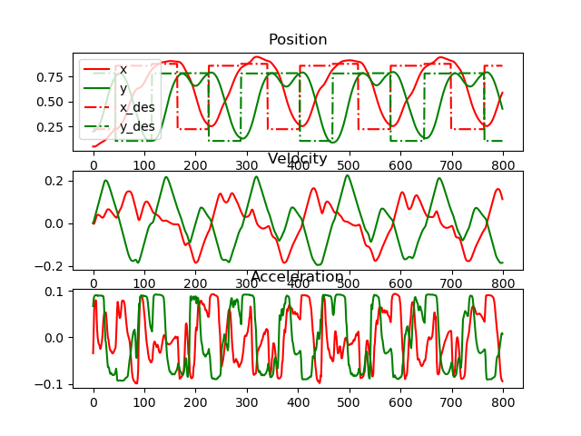

# STORM
**Stochastic Tensor Optimization for Robot Motion** - *A GPU Robot Motion Toolkit*

[[Install Instructions](install_instructions.md)] [[Paper](https://arxiv.org/abs/2104.13542)] [[Website](https://sites.google.com/view/manipulation-mpc/home)]

This package contains code for reactive robot motion leveraging parallel compute on the GPU. The implemented control framework leverages MPPI to optimize over sampled actions and their costs. The costs are computed by rolling out the forward model from the current state with the sampled actions. Most files are documented with sphinx. Once you clone this repo, go into docs folder and run `sh generate_docs.sh` to generate documentation.

**To run on a real Franka Panda, you can use this low-level control wrapper:** [franka_motion_control](https://github.com/mohakbhardwaj/franka_motion_control) from [Mohak Bhardwaj](https://github.com/mohakbhardwaj).
<p align="center">
  
  
</p>


## voxel to sdf 
lean from   STOMP and [RAMP](https://samsunglabs.github.io/RAMP-project-page/).
<p align="center">
  
  
  
</p>

## Sparse Reward for MPPI motivated by RL
learn from [Collaborative Interaction Models for Optimized Human-Robot Teamwork](https://ieeexplore.ieee.org/document/9341369)
<p align="center">
  
</p>

`y = 1 - exp(-dist^2 / (2 * σ^2))` 是一种常用于奖励函数或代价函数设计的数学表达式，通常用于机器学习、优化和控制问题中。下面我们将介绍这个函数的设计原理。

**函数说明：**

- `y`：奖励或代价值。
- `dist`：表示某个状态或状态之间的距离，通常是欧氏距离或其他距离度量。
- `σ`：标准差，是一个控制函数形状的参数。

**设计原理：**

这个函数的设计原理涉及到概率密度函数（PDF）和累积分布函数（CDF）以及高斯分布。

1. **高斯分布：** `y = exp(-x^2 / (2 * σ^2))` 是高斯分布（正态分布）的概率密度函数，其中 `x` 是随机变量，`σ` 控制了分布的标准差。高斯分布通常用于描述自然界中的随机现象。

2. **累积分布函数（CDF）：** CDF 是高斯分布的积分，用于表示在某个值之前观察到随机变量的概率。对于高斯分布，CDF 的表达式为 `CDF(x) = (1/2) * (1 + erf((x - μ) / (σ * sqrt(2))))`，其中 `erf` 是误差函数，`μ` 是分布的均值。

3. **奖励函数设计：** 在强化学习等问题中，我们经常需要设计奖励函数来引导智能体学习。`y = 1 - exp(-dist^2 / (2 * σ^2))` 的设计灵感来自于高斯分布的CDF。这个函数的作用是根据状态之间的距离（`dist`）给出一个奖励值，距离越近，奖励越高。当状态之间的距离非常小（接近零）时，奖励趋于1；当距离远离零时，奖励趋于0。标准差 `σ` 控制了奖励函数的形状，可以调整以适应特定问题的需求。较小的 `σ` 会导致函数在距离较小处变化更快，而较大的 `σ` 会导致函数变化更平滑。

这个奖励函数的设计原理在强化学习中经常用于指导智能体在状态空间中的探索和学习，特别是在连续动作空间中。通过根据状态之间的距离提供不同的奖励，智能体可以更有效地学习适应环境的策略。

reward 在加入前后的对轨迹的影响比较
<table align="center">
  <tr>
    <td align="center">
      
      <br>
      <em>without reward | State[pos:vel:acc]</em>
    </td>
    <td align="center">
      
      <br>
      <em>with reward State[pos:vel:acc]</em>
    </td>
  </tr>
  <tr>
    <td align="center">
      
      <br>
      <em>without reward | yellow says collision</em>
    </td>
    <td align="center">
      
      <br>
      <em>with reward</em>
    </td>
  </tr>
</table>

可以看到，加入reward后，智能体更加贪婪的朝着目标点前进，对目标点的完成度优于没加reward; 但是贪婪的路径意味着探索的缺乏或者对碰撞条件的抑制，这是一个权衡... 黄色增多了


## Updates
Jan. 2022 - Add CoRL citation, merge torch.size() bug (thanks [@maxpahn](https://github.com/maxspahn)).

## Contributors
- Mohak Bhardwaj
- Balakumar Sundaralingam

## Citation
If you use this source code, please cite the below article,

```
@article{storm2021,
  title={{STORM}: An Integrated Framework for Fast Joint-Space Model-Predictive Control for Reactive Manipulation},
  author={Mohak Bhardwaj and Balakumar Sundaralingam and Arsalan Mousavian and Nathan D. Ratliff and Dieter Fox and Fabio Ramos and Byron Boots},
  booktitle={5th Annual Conference on Robot Learning },
  year={2021},}
```

## Contributing to this code
Refer to CLA before making contributions.


```
export PYTHONPATH=$PYTHONPATH:/home/zm/MotionPolicyNetworks/storm_ws/storm_dev/storm
```