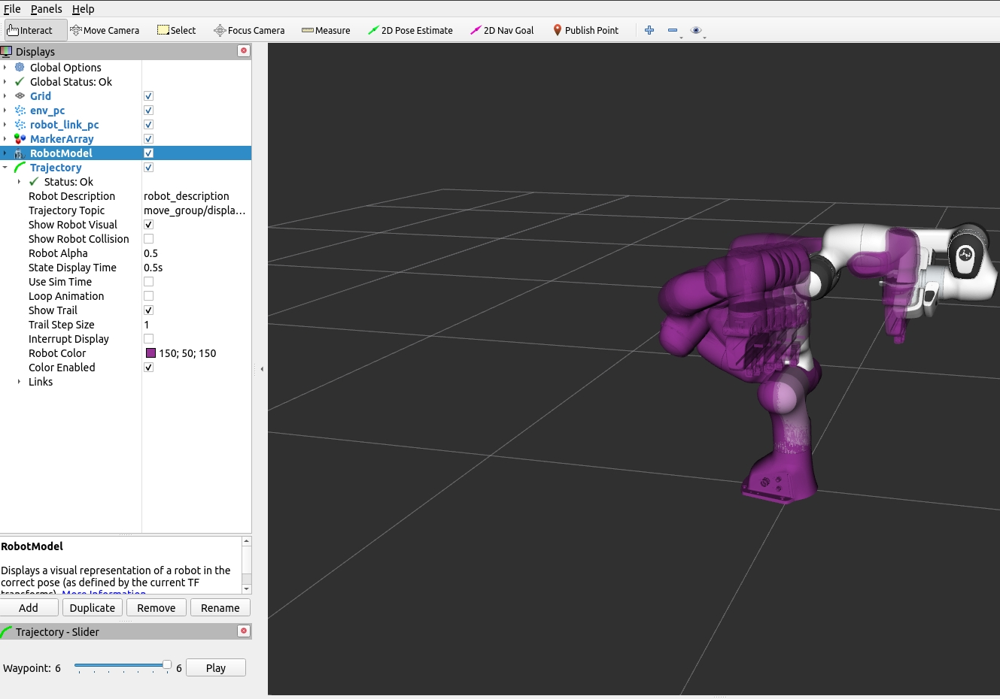

```python
* roslaunch panda_moveit_config demo_sim.launch 
* python -u 
"/home/zm/MotionPolicyNetworks/storm_ws/storm/examples/multimodal_franka/rviz_visual/demo.py"
```

<p align="center">
  
</p>

