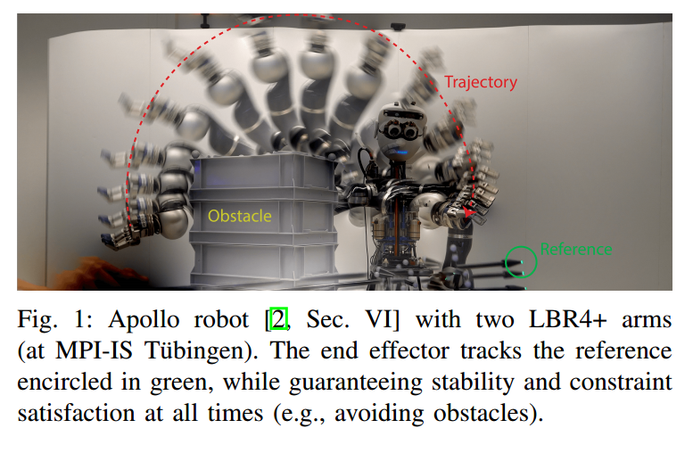

## 1.0 franka位姿设计优化

将全局track_ik 或者 moveit全局规划引入机械臂规划中来

必须要加所谓的全局规划 不加规划是不可能的， MPC只能是对轨迹的优化，不能担当轨迹规划的重任 ，特别是对高维度的，从根本上是不可能的，一定要转过这个弯，一定要把全局规划跟局部规划讨论清楚，这绝对是一个创新点

* Track_IK 使用多进程加入Franka_reacher 框架 有效改善运动位姿情况
* Zero_Vel 限制velocity 在 目标点位附近， 联合Sparse_Reward 改善运动超调问题
* 将dt 从 0.05 提升至 0.06 ，释放算法潜能，快快快！运动时间从95+ 缩减到 80+

## PPV 与 PPV-Theta的对比性 无法说明！ 
会不会是低速限制了PPV_Theta的表现？
首先要保证 PPV_Theta是对的，需要有效的可视化方案
* 如何可视化？：
  1. 当前速度朝向 
  2. 当前梯度方向
  3. every link?
  4. 当前sphere's position

可视化没问题，还是需要说明PPV-Theta的先进性？？ 有没有办法呢？
牺牲那么大的计算代价，到最后效果并不能与PPV相媲美。这就很尴尬。讨巧的方法是跟P或者PV方案做对比。但是这就是仿造数据了

总之，还是要花时间，不断的调整权重，分析问题，将优越性提升上去。
* 动力学问题基本解决
* PPV_Theta 初步实现
* PPV_Theta 与 PPV相比的先进性有待验证
* SDF_Gradient计算量过大 从哪方面着手优化呢？基本可以看到，（整个计算周期要到30ms，12ms的collision_forward查询） 另外4.5ms的代价地图计算
todo:
* 优化collision_forward！12ms -> 9ms? 
* 高速！ 充分挖掘PPV_Theta的益处，将在二维上体现的减少opt_step的性能通过实验表现出来

一个设想，link能不能用两个球体表现collision呢？
计算量？ 冗余？

解决方法： 换实验，左右移动障碍物，说明PPV-Theta的有效性。
* TODO :
  * 可视化轨迹
  * 数据验证 P | PV | PPV | PPV_Theta

## 轨迹跟踪实验
[Safe and Fast Tracking on a Robot Manipulator:Robust MPC and Neural Network Control](https://www.researchgate.net/publication/339423718_Safe_and_Fast_Tracking_on_a_Robot_Manipulator_Robust_MPC_and_Neural_Network_Control?enrichId=rgreq-5f6ee3eb2ec6481265c0d0610e927202-XXX&enrichSource=Y292ZXJQYWdlOzMzOTQyMzcxODtBUzoxMTQzMTI4MTA4NDI5Mjg3N0AxNjYzMTA4NjMyNDY3&el=1_x_3&_esc=publicationCoverPdf)\
[youtube video](https://www.youtube.com/watch?v=c5EekdSl9To)\
we leverage recent results in MPC research
to propose a new robust setpoint tracking MPC algorithm, which
achieves reliable and safe tracking of a dynamic setpoint while
guaranteeing stability and constraint satisfaction.

  

* 实验要求： 目标点时变 （做半圆跳变）； 障碍物在不同的高度左右移动
  * 阶段实验1 ： 动力学模型轨迹跟踪（半圆画弧）高速下应没问题
  * 阶段实验2 ： 障碍物同高度下左右移动应没问题
  * 阶段实验3 ： 障碍物不同高度下左右移动，机械臂画弧

调大 半径 受不了了