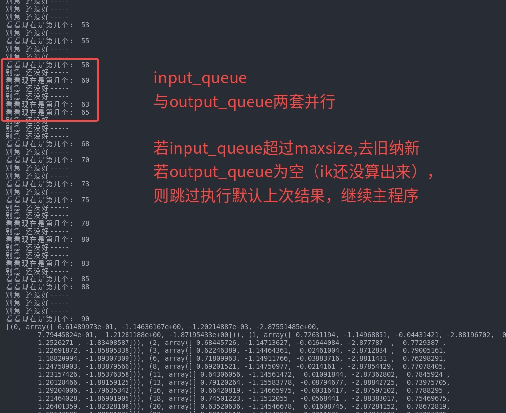

```python
IKProcDemo.py

# 1. 若使用collections.deque 尽管能实现类似容量限制 先进先出等，但是进程间无法共享内存
# 2. 若使用queue，尽管可以借助multiprocessing实现进程间内存共享，但是只设置maxsize的话，超过限制，默认阻塞，等待队列处理完数据给空。
# 使用基于queue自定义类的方式解决这一问题
# 3. 使用get_nowait() 避免阻塞 一定不要阻塞

本代码展示了 多进程IK解算的样本
输出结果为：
    ik_需求已经投放......
    ik_解算已完成  ......
    output_queue装填完毕 ....
    获取请求中 ....:
    物品已接收 ...
    [[ 0.66407247 -1.14705433 -0.00334689 -2.87624611  0.77905702  1.21474477
    -1.86876796]]

    输出结果显示： 在input_queue发出后, ik解算已经开始, 并不是要等到 output_queue唤出来才启动ik解算
    这意味着 并行运算是可行的
```
<p align="center">
  
</p>


```python

测试性文件 ik_solver
pytest examples/multimodal_franka/TRACIK/test_ik.py -v

同样的功能
python examples/multimodal_franka/TRACIK/demo.py

```
